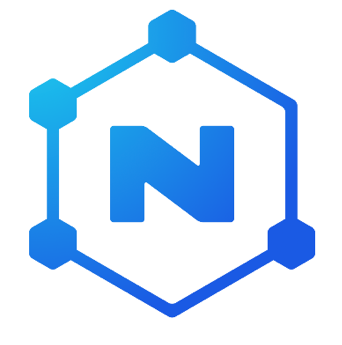

# NORG – Nitrogen ORGanizer: A standalone database system for local preservation of cryomaterial 

The NORG System is a cutting-edge solution designed to revolutionize the way biological samples are managed and preserved. This repository serves as the official documentation for the NORG System, providing a comprehensive guide to its features, functionalities, and implementation.

If you wish, you can try NORG at: https://gin-norg-dev.med.uni-giessen.de/

### Overview

The NORG System addresses a critical challenge in the field of sample preservation – the efficient management of diverse biological samples, ranging from human specimens to plant materials. The preservation process typically involves packaging samples into appropriate containers and storing them in various environments, such as cryogenic containers, freezers, and more. To maximize the value of a biological sample database, meticulous cataloging and continuous maintenance are essential. Without a clear understanding of the sample locations, the database loses its significance.

In many instances, sample documentation is carried out using local spreadsheets saved in formats like CSV or XLSX. In some cases, even handwritten records are utilized to track sample locations. The primary purpose of a biological database is to collect and store rare materials while facilitating sample withdrawal for further analysis, both internally and in collaboration with external partners.

A recurring issue arises when samples are withdrawn from containers that are already fully stored. Reallocating empty spaces within containers demands extensive administrative efforts. Without efficient management, new samples might unintentionally occupy containers that are currently active, leading to inefficiencies and potential data loss.

### Introducing NORG

The NORG System offers a comprehensive and user-friendly software solution through web services, revolutionizing the way biological samples are managed. Key features include:

#### Sample Cataloging: 
NORG provides a seamless platform to digitally catalog various sample types, ensuring accurate record-keeping and easy retrieval.
#### Color-Coded Filling Levels: 
To simplify the monitoring of storage conditions, NORG employs color-coding to indicate the filling levels of storage units, such as nitrogen tanks. This visual representation enhances efficient sample management.
#### Traceability: 
NORG enables transparent tracking of sample movement. Users can easily identify the origins and destinations of samples, streamlining collaboration with external partners and analytical processes.
#### Cooperation Tracking: 
Collaborative projects become more manageable with NORG's ability to trace sample transfers to and from external partners. This feature facilitates analysis by ensuring seamless communication and tracking.
Getting Started

### Contact
For inquiries, support, and collaboration opportunities, please contact daniel.amsel@patho.med.uni-giessen.de .

Thank you for considering the NORG System as your next-generation solution for biological sample management. Together, we can revolutionize the way we preserve and utilize valuable biological resources.

### Required Software
- Docker
- Docker-compose

  
### How to install 
The installation is easily manageable via Docker containerization and Docker-compose.

`git clone https://github.com/DanielAmsel/GIN-NORG.git`

`cd GIN-NORG`

`docker-compose up`

If this is your first start, your need to initialize the databse by using these three commands:

`docker exec norg_laravel php artisan key:generate`

`docker exec norg_laravel php artisan migrate`

`docker exec norg_laravel php artisan db:seed`

`docker exec norg_laravel php artisan route:cache`

You can now login via the default credentials
`admin@norg.de`
`adminpass`
*please change the credentials as soon as you can*

It is highly recommendable to do system backups of the data you entered into your database. Instead of programming a complex backup solution, we rely on commonly used and well-known cron-jobs that run an export script of the database as often as you like.

### Database backup:
- make db_export.sh script executable
-> chmod +x db_export.sh
- Copy the script to the container
-> docker exec -i [mariadb container name] bash -c "/tmp/db_export.sh"
- Replace the placeholders with your actual values in the db_export.sh script:
    - USERNAME="your_username"
    - PASSWORD="your_password"
    - DATABASE_NAME="your_database_name"
    - EXPORT_BASE_PATH="/dumps"

For daily database Dump install Cron 
- sudo apt-get update
- sudo apt-get install cron
    - crontab -e
    Command: 59 23 * * * docker exec -i [mariadb container name] bash -c "/tmp/db_export.sh
    
If you just want SQL-Dump: Command: 59 23 * * *  docker exec -i [mariadb container name] mysqldump -u root --password=  bitnami_myapp > /home/[Benutzer]/Projekte/GIN-NORG/public/sqldumps/NorgDBdump$(date +\%Y\%m\%d).sql

## How to use

For Database Dump import:
with the import script:
- Make the script executable 
-> chmod +x db_import.sh
- Copy the script to the container:
-> docker cp db_import.sh projekte_mariadb_1:/tmp/db_import.sh
- Replace the placeholders with your actual values in the db_import.sh script:
    - USERNAME="your_username"
    - PASSWORD="your_password"
    - DATABASE_NAME="your_database_name"
    - DATE="[date]"
    - EXPORT_BASE_PATH="/dumps"
    - EXPORT_PATH="$EXPORT_BASE_PATH/NorgDBdump$DATE"
either from SQL Dump import or from the CSV files -> comment out one of the versions in the script ether the commands for the csv-import or the sql import

-> Run the import script:
-> docker exec -i [mariadb container name] bash -c "/tmp/db_import.sh"

For the SQL import, if you have done the SQL-Dump command without the script:
- docker exec -i [mariadb container name] mysql --user root bitnami_myapp < public/sqldumps/NorgDBdump[date].sql

## License

## How to cite
